<div align="center">

# 📰 News Cloud

[](https://flutter.dev)
[](https://dart.dev)
[](LICENSE)
[](https://flutter.dev)

**A modern, fast, and intuitive news aggregator app delivering real-time headlines across multiple categories with a sleek, responsive UI, native splash screen, and adaptive launcher icons.**

[📱 Demo Video](#-demo-video) • [✨ Features](#-features) • [📸 Screenshots](#-screenshots) • [🏗️ Architecture](#-architecture) • [🚀 Getting Started](#-getting-started) • [👤 Author](#-author)

</div>

---

## 📱 Demo Video

<div align="center">

### 🎬 Watch News Cloud in Action

**[🔗 Watch on YouTube Shorts](https://youtube.com/shorts/AKbiBjCRIis)**

*A quick showcase of browsing categories, reading headlines, and opening full articles.*

</div>

---

## 🎯 Overview

**News Cloud** is a production-ready Flutter news application that aggregates real-time headlines from [NewsData.io](https://newsdata.io/). It features a clean, category-driven interface with smooth navigation, cached images, an integrated web reader, native splash screen, adaptive launcher icons, and full Arabic typography support — built as a portfolio project demonstrating modern mobile development practices with code generation, repository pattern, and type-safe API clients.

### 💡 Key Highlights
- 📰 **Multi-Category News** — General, Technology, Sports, Business, Entertainment
- ⚡ **Fast Loading** — Cached images with `CachedNetworkImage` for smooth scrolling
- 🌐 **In-App Reader** — Full articles open in integrated WebView without leaving the app
- 🎨 **Dynamic Category UI** — Single reusable category view with distinct visual identity per category
- 📱 **Responsive Design** — Sliver-based layouts with `flutter_screenutil` for all screen sizes
- 🛡️ **Error Resilience** — Graceful handling of missing images, empty responses, and network errors
- 🏗️ **Repository Pattern** — Clean separation between data layer and UI layer
- 🔌 **Type-Safe API** — Retrofit-generated HTTP client with automatic JSON parsing
- 🖋️ **Arabic Typography** — Custom Cairo font with full RTL support
- 🚀 **Native Branding** — Custom splash screen and adaptive launcher icons for Android & iOS

---

## ✨ Features

### 📰 Core Features
- **Breaking News Feed** — Top headlines from Egypt, Iran, Palestine, Israel, Saudi Arabia
- **Category Browsing** — Horizontal scrollable category cards with image backgrounds
- **Dynamic Category Views** — Single reusable `NewsCategoryView` driven by `CategoryModel` data
- **Country-Specific Filtering** — Sports category filtered by specific countries (EG, ES, SA, GB, FR)
- **Article Previews** — Headline, description, and thumbnail in elegant card layout
- **Full Article WebView** — Read complete articles in-app with `webview_flutter`
- **Smart Image Handling** — Placeholder loaders, error fallbacks, and smooth caching
- **Empty State Handling** — Friendly message when no news is available
- **Native Splash Screen** — Branded launch experience with custom logo
- **Adaptive App Icons** — Platform-specific launcher icons with background/foreground layers

### ⚙️ Technical Features
- **REST API Integration** — Real-time data from NewsData.io via Retrofit + Dio
- **Type-Safe HTTP Client** — Retrofit annotations with compile-time route validation
- **Code Generation** — Automated JSON serialization and API client generation via `build_runner`
- **Repository Pattern** — `Repo` class abstracts all data operations from the UI
- **JSON Serialization** — `json_serializable` with generated `fromJson`/`toJson` methods
- **Response Wrapping** — `NewsResponse` model handles API status and results list
- **Image Caching** — `CachedNetworkImage` for optimal performance and offline image viewing
- **Sliver Architecture** — `CustomScrollView` with `SliverList`, `SliverToBoxAdapter` for smooth scrolling
- **WebView Integration** — Full browser experience within the app
- **Responsive Scaling** — `flutter_screenutil` for pixel-perfect UI across devices
- **Defensive Parsing** — Null-safe JSON parsing with fallback values
- **Reusable Components** — Modular widgets for categories, news lists, and cards
- **Debug Logging** — `pretty_dio_logger` for detailed HTTP request/response inspection
- **App Renaming** — `rename` package for easy BundleId and AppName updates across platforms

---

## 📸 Screenshots

<div align="center">

| 🏠 Main View | 📰 Main View (Scroll) | 🎯 Categories |
|:-----------:|:---------------------:|:-------------:|
| 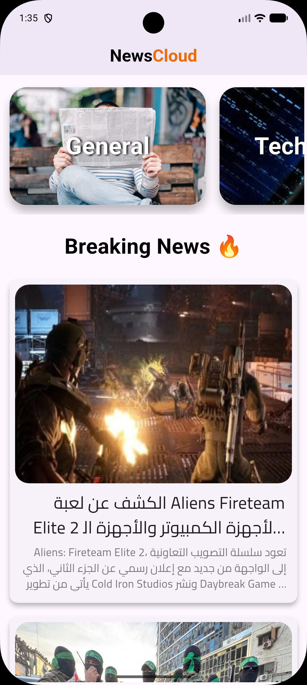 | 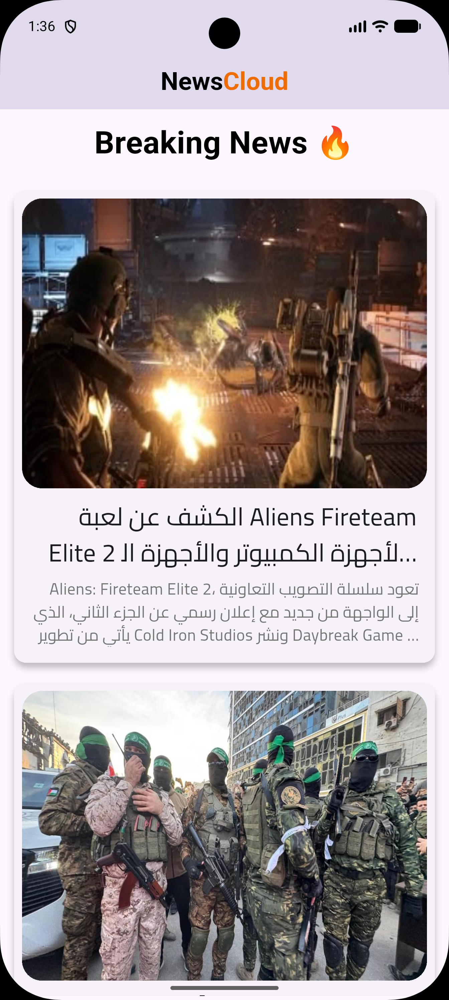 | 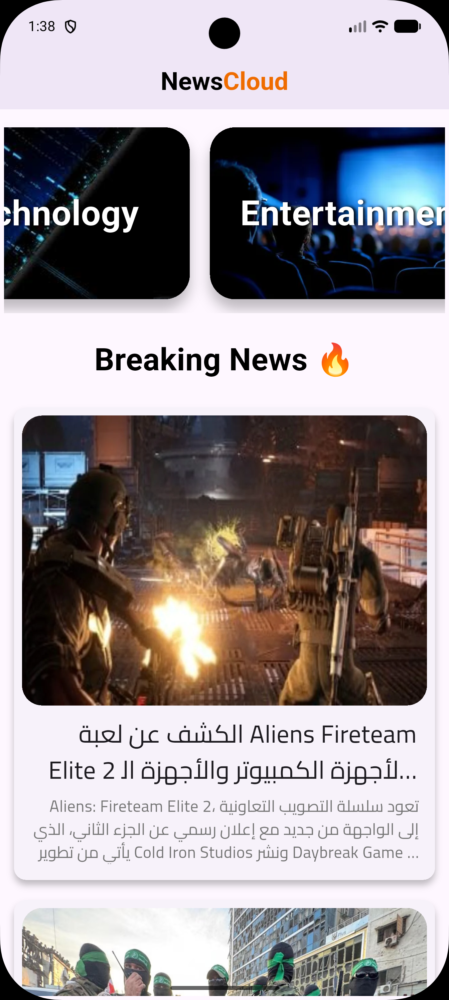 |
| Breaking news feed | Scroll through headlines | Category selection |

| 📰 Main View (More) | 🎨 Splash Screen | 💼 Business |
|:-------------------:|:----------------:|:-----------:|
| 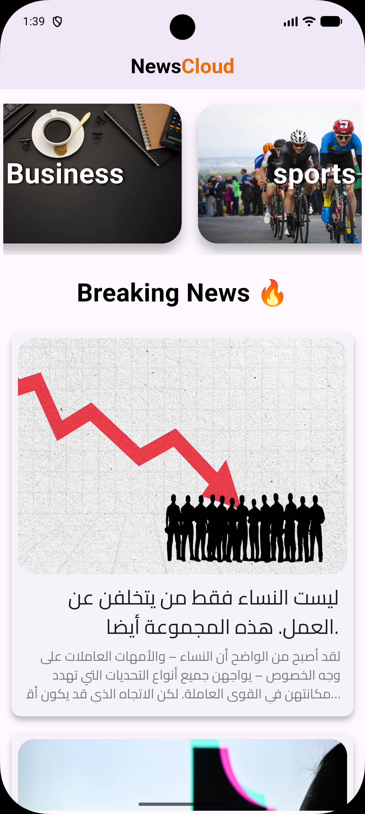 | 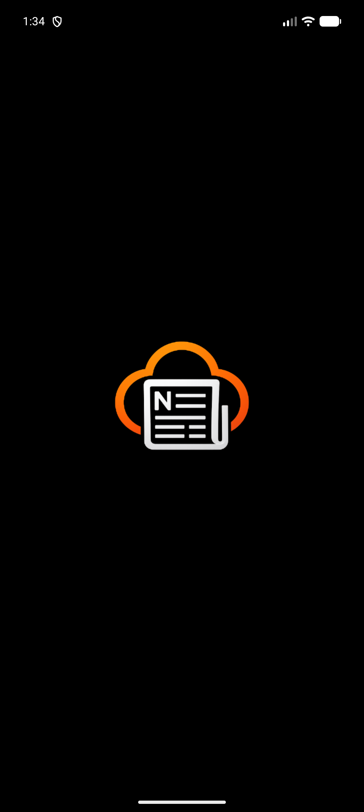 | 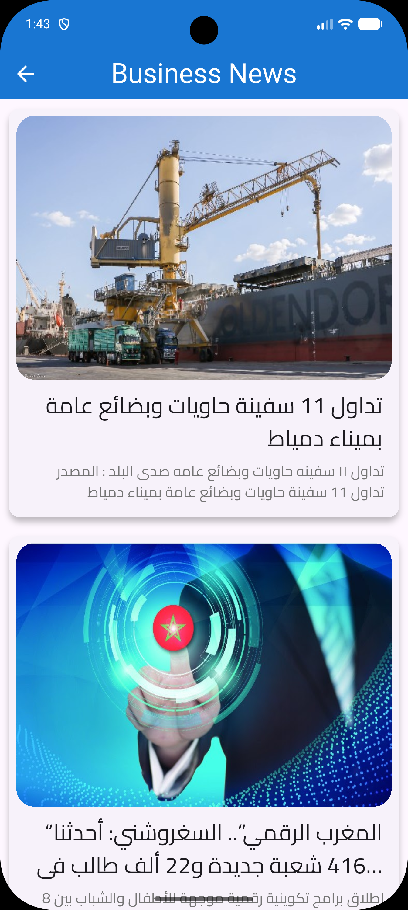 |
| Extended news feed | Native launch screen | Business headlines |

| 🎬 Entertainment | 🌍 General | ⚽ Sports |
|:----------------:|:----------:|:----------:|
| 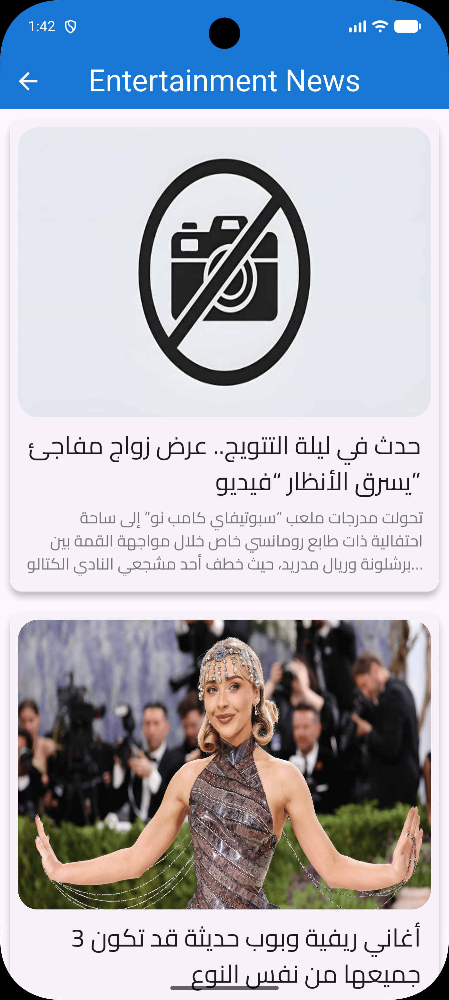 | 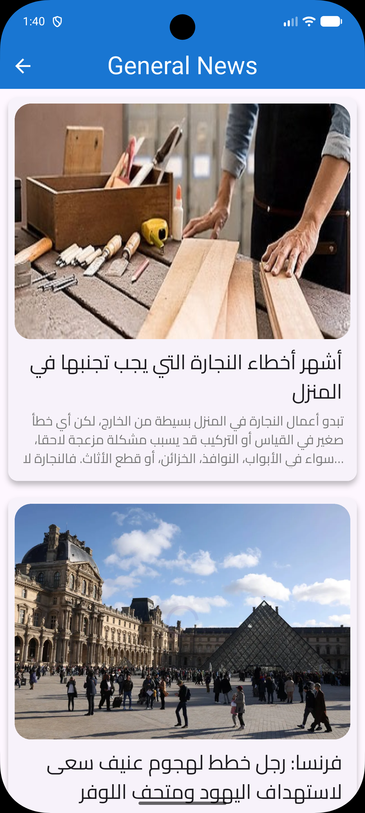 | 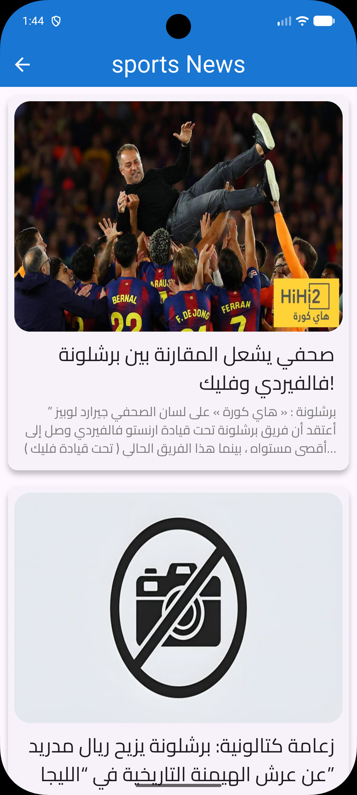 |
| Entertainment news | General & world news | Sports updates |

| 💻 Technology | 🖼️ App Logo | 🌐 Article Reader |
|:-----------:|:-----------:|:-----------------:|
| 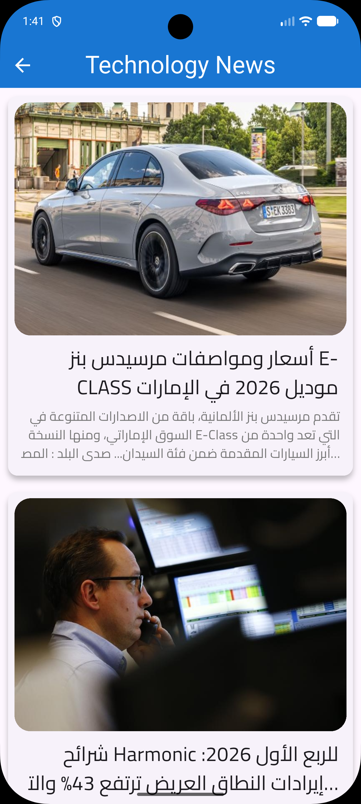 | 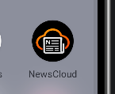 | 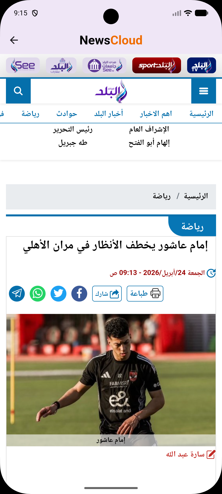 |
| Tech news | App icon (145×119) | In-app WebView |

</div>

---

## 🛠️ Technical Stack

<div align="center">

| Component | Technology | Purpose |
|:-----------------:|:----------------:|:------------------------------:|
| **Framework** | Flutter 3.x | Cross-platform UI |
| **Language** | Dart 3.x | Core development |
| **HTTP Client** | Dio ^5.x | HTTP client for API calls |
| **Type-Safe API** | Retrofit ^4.x | Annotation-driven API interfaces |
| **API Generator** | retrofit_generator ^10.x | Auto-generates Dio service implementations |
| **JSON Parsing** | json_serializable ^6.x | Automated JSON model serialization |
| **Code Gen** | build_runner ^2.x | Dart build system for generated files |
| **Debug Logging** | pretty_dio_logger ^1.x | HTTP request/response logging |
| **Image Caching** | cached_network_image ^3.x | Fast image loading & caching |
| **WebView** | webview_flutter ^4.x | In-app article reading |
| **Responsive UI** | flutter_screenutil ^5.x | Screen adaptation & scaling |
| **State Mgmt** | setState / FutureBuilder | UI state handling |
| **API** | NewsData.io | Real-time news data |
| **Native Splash** | flutter_native_splash ^2.x | Branded launch screen |
| **Launcher Icons** | flutter_launcher_icons ^0.14.x | Platform app icons |
| **App Renaming** | rename ^3.x | BundleId & AppName management |
| **Typography** | Cairo Font | Arabic text rendering |
| **Design** | Material 3 | Latest UI patterns |

</div>

---

## 🏗️ Architecture

### 📁 Project Structure

```
lib/
├── main.dart                          # App entry point with ScreenUtilInit
│
├── data/                              # 📦 Data Layer
│   ├── models/                        # 📊 Data Models
│   │   ├── category_model.dart        # Category configuration (image, name, filters)
│   │   ├── news_model.dart            # News article & response data structures
│   │   └── news_model.g.dart          # Generated JSON serialization code
│   ├── repo/                          # 🏛️ Repository Pattern
│   │   └── repo.dart                  # Abstracts all data operations from UI
│   └── services/                      # 🔌 API Service Layer
│       ├── web_services.dart          # Retrofit API interface with annotations
│       └── web_services.g.dart      # Generated Retrofit implementation
│
├── helper/
│   └── constants/
│       └── strings.dart               # API base URL & API key constants
│
├── views/                             # 🎬 UI Screens
│   ├── main_View.dart                 # Home screen with categories + breaking news
│   ├── news_category_view.dart        # Dynamic category news screen
│   └── news_web_view.dart             # WebView for full article reading
│
└── widgets/                           # 🧩 Reusable UI Components
    ├── breaking_news_list.dart        # Stateful breaking news FutureBuilder
    ├── categories_list_builder.dart   # Horizontal scrollable category cards
    ├── category_card.dart             # Individual category card with image background
    ├── category_news_list.dart        # Stateful category news FutureBuilder
    ├── news_card.dart                 # Individual news article card
    ├── news_list_builder.dart         # Generic FutureBuilder for news lists
    ├── sliver_news_card.dart          # SliverList wrapper for news cards
    └── title_widget.dart              # "Breaking News 🔥" header

assets/
├── fonts/
│   └── Cairo-Regular.ttf              # Arabic typography support
└── images/                            # Category backgrounds & app logo
    ├── app_logo.png
    ├── general.avif
    ├── technology.jpeg
    ├── entertainment.webp
    ├── business.avif
    └── sports.avif
```

### 🔄 Data Flow

```
┌─────────────┐     ┌─────────────┐     ┌─────────────┐     ┌─────────────┐     ┌─────────────┐
│    Views    │────▶│    Repo     │────▶│  WebServices│────▶│    Dio      │────▶│ NewsData.io │
│  (Widgets)  │◀────│ (Abstracts) │◀────│  (Retrofit) │◀────│   (HTTP)    │◀────│    API      │
└─────────────┘     └─────────────┘     └─────────────┘     └─────────────┘     └─────────────┘
      │
      ▼
┌─────────────┐
│   Models    │
│ (fromJson)  │
└─────────────┘
```

---

## 🌐 API Integration

**Base URL:** `https://newsdata.io/api/1/`

| Endpoint | Method | Service Method | Response |
|:---------|:------:|:---------------|:---------|
| `/latest` | `GET` | `getTopNews()` | `NewsResponse` |
| `/latest` | `GET` | `getNewsByCategory()` | `NewsResponse` |
| `/latest` | `GET` | `getCountriesNewsByCategory()` | `NewsResponse` |

**Parameters:**
- `apikey` — API key (required)
- `country` — Filter by country codes (eg, sa, gb, fr, es, etc.)
- `language` — Article language (ar, en)
- `category` — News category (business, sports, technology, entertainment, etc.)

**HTTP Client:** Dio with Retrofit annotations, `pretty_dio_logger` for debugging, and fallback empty lists.

**Example Response:**
```json
{
  "status": "success",
  "results": [
    {
      "title": "Breaking: Major Tech Announcement",
      "description": "A leading tech company unveiled its latest innovation...",
      "link": "https://example.com/article",
      "image_url": "https://example.com/image.jpg",
      "category": ["technology"],
      "country": ["eg"],
      "language": "ar"
    }
  ]
}
```

---

## 🧩 Data Models

### NewsResponse
```dart
@JsonSerializable()
class NewsResponse {
  final String? status;
  @JsonKey(name: "results")
  final List<NewsModel>? results;

  NewsResponse({this.status, this.results});

  factory NewsResponse.fromJson(Map<String, dynamic> json) =>
      _$NewsResponseFromJson(json);
}
```

### NewsModel
```dart
@JsonSerializable()
class NewsModel {
  @JsonKey(name: "image_url")
  final String? imageUrl;      // Article thumbnail URL (nullable)
  @JsonKey(name: "title")
  final String headLine;       // Article title
  @JsonKey(name: "description")
  final String? subHeadLine;   // Article description (nullable)
  @JsonKey(name: "link")
  final String newsUrl;        // Full article link

  NewsModel({
    required this.imageUrl,
    required this.headLine,
    required this.subHeadLine,
    required this.newsUrl,
  });

  factory NewsModel.fromJson(Map<String, dynamic> json) =>
      _$NewsModelFromJson(json);

  Map<String, dynamic> toJson() => _$NewsModelToJson(this);
}
```

### CategoryModel
```dart
class CategoryModel {
  final String imagePath;      // Local asset path for category background
  final String pageName;       // Display name (General, Technology, etc.)
  final String categories;     // API category filter string
  final String? country;       // Optional country filter query string

  CategoryModel({
    required this.imagePath,
    required this.pageName,
    required this.categories,
    this.country,
  });
}
```

---

## 🎨 Category System

Each category features a distinct visual identity with custom background images and optional country filtering:

| Category | Image Asset | API Categories | Country Filter |
|:---------|:------------|:---------------|:-------------|
| **General** | `general.avif` | `other,crime,world` | — |
| **Technology** | `technology.jpeg` | `technology` | — |
| **Entertainment** | `entertainment.webp` | `entertainment` | — |
| **Business** | `business.avif` | `business` | — |
| **Sports** | `sports.avif` | `sports` | `eg,es,sa,gb,fr` |

---

## ⚙️ Code Generation

This project uses **Dart build_runner** for automated code generation. Generated files are marked with `// GENERATED CODE - DO NOT MODIFY BY HAND`.

### Generated Files
| File | Generator | Purpose |
|:-----|:----------|:--------|
| `news_model.g.dart` | `json_serializable` | JSON serialization/deserialization |
| `web_services.g.dart` | `retrofit_generator` | Dio HTTP client implementation |

### Build Commands
```bash
# Generate code once
flutter pub run build_runner build

# Generate code and watch for changes (recommended during development)
flutter pub run build_runner build --delete-conflicting-outputs

# Continuous watching
flutter pub run build_runner watch --delete-conflicting-outputs
```

---

## 📦 Dependencies

```yaml
dependencies:
  flutter:
    sdk: flutter

  # Networking & Type-Safe API
  dio: ^5.9.2
  retrofit: ^4.9.2
  retrofit_generator: ^10.2.6
  pretty_dio_logger: ^1.4.0

  # JSON Serialization
  json_annotation: ^4.11.0

  # UI & Media
  webview_flutter: ^4.13.1
  cached_network_image: ^3.4.1
  flutter_screenutil: ^5.9.3
  cupertino_icons: ^1.0.9

  # Native Branding & Configuration
  flutter_native_splash: ^2.4.7
  flutter_launcher_icons: ^0.14.4
  rename: ^3.1.0

dev_dependencies:
  flutter_test:
    sdk: flutter
  flutter_lints: ^6.0.0
  json_serializable: ^6.13.2
  build_runner: ^2.15.0
```

```bash
flutter pub get
```

---

## 🚀 Getting Started

### 📋 Prerequisites

| Requirement | Version | Purpose |
|:-------------:|:---------:|:-----------------:|
| Flutter SDK | >=3.0.0 | Framework |
| Dart SDK | >=3.0.0 | Language |
| NewsData.io | Free key | News API |

### 💻 Installation

```bash
# 1. Clone the repository
git clone https://github.com/ahmed-el-bialy/news_cloud.git
cd news_cloud

# 2. Install dependencies
flutter pub get

# 3. Generate code (required for Retrofit & JSON models)
flutter pub run build_runner build --delete-conflicting-outputs

# 4. Set your NewsData.io API key in lib/helper/constants/strings.dart
#    const String myApiKey = "YOUR_API_KEY_HERE";

# 5. Run the app
flutter run

# Build for production
flutter build apk --release      # Android
flutter build ios --release      # iOS
```

---

## 🎨 Native Splash Screen & Launcher Icons

### Configuration (pubspec.yaml)
```yaml
flutter_native_splash:
  color: "#000000"
  icon_background_color: "#000000"
  image: assets/images/app_logo.png
  image_dark: assets/images/app_logo.png
  android_12:
    image: assets/images/app_logo.png
    icon_background_color: "#000000"
    icon_background_color_dark: "#000000"

flutter_launcher_icons:
  android: true
  ios: true
  image_path: "assets/images/app_logo.png"
  adaptive_icon_background: "#000000"
  adaptive_icon_foreground: "assets/images/app_logo.png"
  image_ratio_android: 1.4
```

### Generate Assets
```bash
# Generate native splash screen
flutter pub run flutter_native_splash:create

# Generate launcher icons
flutter pub run flutter_launcher_icons:generate
```

---

## ⚠️ Known Limitations

| Issue | Details | Status |
|:-----------------------|:-------------------------------------|:------------------:|
| API key in source code | Hardcoded in strings.dart | 🔧 Planned fix |
| No offline mode | Requires active internet connection | 🔧 Planned |
| No bookmarks/saved | Cannot save articles for later | 🔧 Planned |
| No search | Cannot search for specific topics | 🔧 Planned |
| No push notifications | No breaking news alerts | 🔧 Planned |
| No dark mode | Light theme only | 🔧 Planned |

---

## 🔮 Roadmap

- [ ] Secure API key management (environment variables / Firebase Remote Config)
- [ ] Article bookmarks with local persistence (Hive / SharedPreferences)
- [ ] Full-text search across all categories
- [ ] Push notifications for breaking news
- [ ] Dark mode support
- [ ] Multi-language UI (Arabic, English)
- [ ] Infinite scroll / pagination
- [ ] Share articles to social media
- [ ] Unit & widget tests
- [ ] CI/CD with GitHub Actions

---

## 🤝 Contributing

Contributions are welcome!

1. **Fork** the repository
2. **Create** a feature branch: `git checkout -b feature/your-feature`
3. **Generate code** after model changes: `flutter pub run build_runner build`
4. **Commit** your changes: `git commit -m 'feat: Add awesome feature'`
5. **Push** to the branch: `git push origin feature/your-feature`
6. **Open** a Pull Request

---

## 📄 License

This project is licensed under the **MIT License** — see the [LICENSE](LICENSE) file for details.

---

## 👤 Author

<div align="center">

**Ahmed El-Bialy**  
*Flutter Developer | Mobile App Specialist*

[](https://www.linkedin.com/in/ahmedel-bialy/)
[](mailto:ah.elbialy.dev@gmail.com)
[](tel:+201022121573)
[](https://github.com/ahmed-el-bialy)

📧 **Email:** ah.elbialy.dev@gmail.com  
📞 **Phone:** +20 102 212 1573

</div>

---

<div align="center">

### ⭐ Star this repo if you found it helpful!

**Built with ❤️ by Ahmed El-Bialy**

</div>
