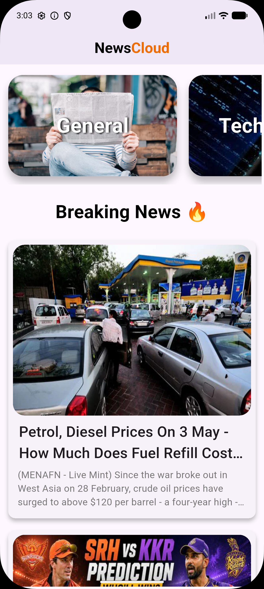
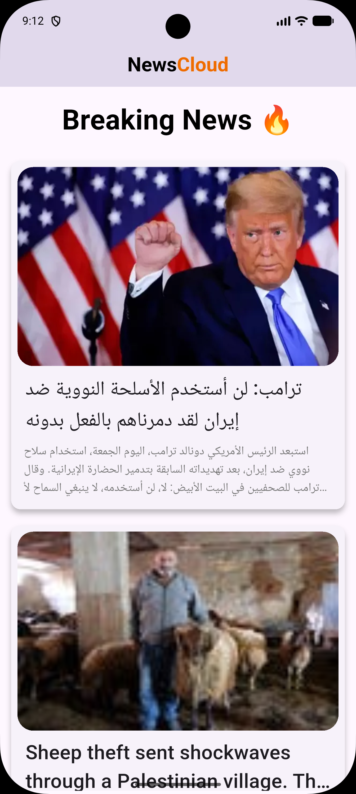
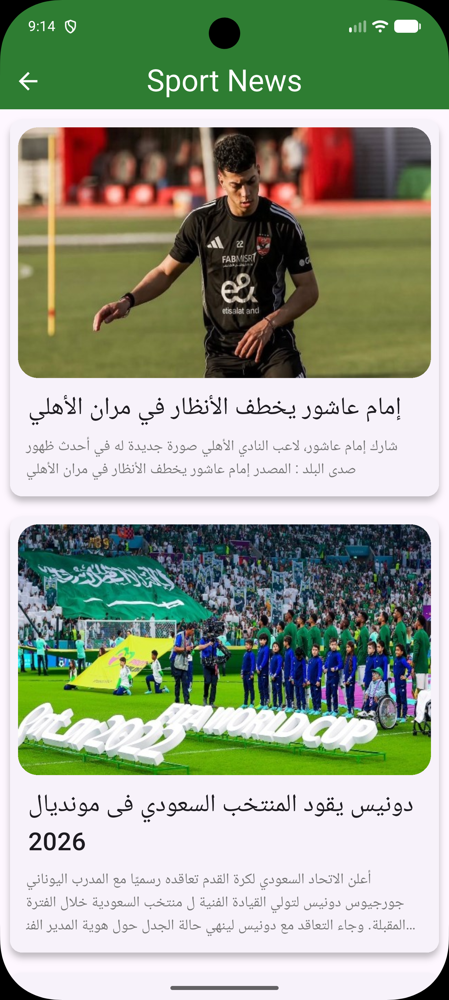
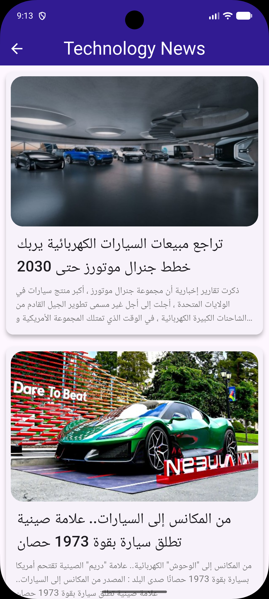

<div align="center">

# 📰 News Cloud

[](https://flutter.dev)
[](https://dart.dev)
[](LICENSE)
[](https://flutter.dev)

**A modern, fast, and intuitive news aggregator app delivering real-time headlines across multiple categories with a sleek, responsive UI.**

[📱 Demo Video](#-demo-video) • [✨ Features](#-features) • [📸 Screenshots](#-screenshots) • [🏗️ Architecture](#-architecture) • [🚀 Getting Started](#-getting-started) • [👤 Author](#-author)

</div>

---

## 📱 Demo Video

<div align="center">

### 🎬 Watch News Cloud in Action

**[🔗 Watch on YouTube Shorts](https://youtube.com/shorts/AKbiBjCRIis)**

*A quick showcase of browsing categories, reading headlines, and opening full articles.*

</div>

---

## 🎯 Overview

**News Cloud** is a modern Flutter news application that aggregates real-time headlines from [NewsData.io](https://newsdata.io/). It features a clean, category-driven interface with smooth navigation, cached images, and an integrated web reader — built as a portfolio project demonstrating production-ready mobile development practices.

### 💡 Key Highlights
- 📰 **Multi-Category News** — General, Technology, Sports, Business, Entertainment
- ⚡ **Fast Loading** — Cached images with `CachedNetworkImage` for smooth scrolling
- 🌐 **In-App Reader** — Full articles open in integrated WebView without leaving the app
- 🎨 **Dynamic Category UI** — Single reusable category view with distinct AppBar colors per category
- 📱 **Responsive Design** — Sliver-based layouts with `CustomScrollView` and `flutter_screenutil` for all screen sizes
- 🛡️ **Error Resilience** — Graceful handling of missing images, empty responses, and network errors

---

## ✨ Features

### 📰 Core Features
- **Breaking News Feed** — Top headlines from Egypt, Iran, Palestine, Israel, Saudi Arabia
- **Category Browsing** — Horizontal scrollable category cards with image backgrounds
- **Dynamic Category Views** — Single reusable `NewsCategoryView` driven by `CategoryModel` data
- **Article Previews** — Headline, description, and thumbnail in elegant card layout
- **Full Article WebView** — Read complete articles in-app with `webview_flutter`
- **Smart Image Handling** — Placeholder loaders, error fallbacks, and smooth caching
- **Empty State Handling** — Friendly message when no news is available

### ⚙️ Technical Features
- **REST API Integration** — Real-time data from NewsData.io with Dio HTTP client
- **Image Caching** — `CachedNetworkImage` for optimal performance and offline image viewing
- **Sliver Architecture** — `CustomScrollView` with `SliverList`, `SliverToBoxAdapter` for smooth scrolling
- **WebView Integration** — Full browser experience within the app
- **Responsive Scaling** — `flutter_screenutil` for pixel-perfect UI across devices
- **Defensive Parsing** — Null-safe JSON parsing with fallback values
- **Reusable Components** — Modular widgets for categories, news lists, and cards

---

## 📸 Screenshots

<div align="center">

| 🏠 Main View | 📰 Main View (Scroll) | 🎯 Categories |
|:-----------:|:---------------------:|:-------------:|
|  |  |  |
| Breaking news feed | Scroll through headlines | Category selection |

| 💼 Business | 🎬 Entertainment | 🌍 General |
|:-----------:|:----------------:|:----------:|
|  |  |  |
| Business headlines | Entertainment news | General & world news |

| ⚽ Sports | 💻 Technology | 🌐 Article Reader |
|:----------:|:-----------:|:-----------------:|
|  |  |  |
| Sports updates | Tech news | In-app WebView |

</div>

---

## 🛠️ Technical Stack

<div align="center">

| Component | Technology | Purpose |
|:-----------------:|:----------------:|:------------------------------:|
| **Framework** | Flutter 3.x | Cross-platform UI |
| **Language** | Dart 3.x | Core development |
| **HTTP Client** | Dio ^5.x | News API calls |
| **Image Caching** | cached_network_image ^3.x | Fast image loading & caching |
| **WebView** | webview_flutter ^4.x | In-app article reading |
| **Responsive UI** | flutter_screenutil ^5.x | Screen adaptation & scaling |
| **State Mgmt** | setState / FutureBuilder | UI state handling |
| **API** | NewsData.io | Real-time news data |
| **Design** | Material 3 | Latest UI patterns |

</div>

---

## 🏗️ Architecture

### 📁 Project Structure

```
lib/
├── main.dart                          # App entry point with ScreenUtilInit
│
├── helper/
│   └── constants/
│       └── strings.dart               # API base URL & API key constants
│
├── models/                            # 📊 Data Models
│   ├── news_model.dart                # News article data structure
│   └── category_model.dart            # Category configuration (image, name, filters)
│
├── services/                          # 🔌 API Service Layer
│   └── news_services.dart             # Dio calls to NewsData.io
│
├── views/                             # 🎬 UI Screens
│   ├── main_view.dart                 # Home screen with categories + breaking news
│   ├── news_category_view.dart        # Dynamic category news screen
│   └── news_details_view.dart         # WebView for full article reading
│
└── widgets/                           # 🧩 Reusable UI Components
    ├── categories_list_builder.dart   # Horizontal scrollable category cards
    ├── category_card.dart             # Individual category card with image background
    ├── breaking_news_list.dart        # Stateful breaking news FutureBuilder
    ├── category_news_list.dart        # Stateful category news FutureBuilder
    ├── news_list_builder.dart         # Generic FutureBuilder for news lists
    ├── sliver_news_card.dart          # SliverList wrapper for news cards
    ├── news_card.dart                 # Individual news article card
    └── title_widget.dart              # "Breaking News 🔥" header
```

### 🔄 Data Flow

```
┌─────────────┐     ┌─────────────┐     ┌─────────────┐     ┌─────────────┐
│   Views     │────▶│  Services   │────▶│    Dio      │────▶│ NewsData.io │
│  (Widgets)  │◀────│ (API Call)  │◀────│   (HTTP)    │◀────│    API      │
└─────────────┘     └─────────────┘     └─────────────┘     └─────────────┘
      │
      ▼
┌─────────────┐
│   Models    │
│ (fromJson)  │
└─────────────┘
```

---

## 🌐 API Integration

**Base URL:** `https://newsdata.io/api/1`

| Endpoint | Method | Service Method | Response |
|:---------|:------:|:---------------|:---------|
| `/latest` | `GET` | `getTopNews()` | `List<NewsModel>` |
| `/latest` | `GET` | `getCategoryNews()` | `List<NewsModel>` |

**Parameters:**
- `apikey` — API key (required)
- `country` — Filter by country codes (eg, sa, gb, etc.)
- `language` — Article language (ar, en)
- `category` — News category (business, sports, technology, entertainment, etc.)

**HTTP Client:** Dio with error handling and fallback empty lists.

**Example Response:**
```json
{
  "results": [
    {
      "title": "Breaking: Major Tech Announcement",
      "description": "A leading tech company unveiled its latest innovation...",
      "link": "https://example.com/article",
      "image_url": "https://example.com/image.jpg",
      "category": ["technology"],
      "country": ["eg"],
      "language": "ar"
    }
  ]
}
```

---

## 🧩 Data Models

### NewsModel
```dart
class NewsModel {
  final String? imageUrl;      // Article thumbnail URL (nullable)
  final String headLine;       // Article title
  final String? subHeadLine;   // Article description (nullable)
  final String newsUrl;        // Full article link

  NewsModel({
    required this.imageUrl,
    required this.headLine,
    required this.subHeadLine,
    required this.newsUrl,
  });

  factory NewsModel.fromJson(jsonData) => NewsModel(
    imageUrl: jsonData['image_url'] ?? fallbackImageUrl,
    headLine: jsonData['title'] ?? "Without Title",
    subHeadLine: jsonData['description'] ?? "Description doesn't exist",
    newsUrl: jsonData["link"] ?? fallbackUrl,
  );
}
```

### CategoryModel
```dart
class CategoryModel {
  final String imagePath;      // Local asset path for category background
  final String pageName;       // Display name (General, Technology, etc.)
  final String categories;     // API category filter string
  final String country;        // Optional country filter query string

  CategoryModel({
    required this.imagePath,
    required this.pageName,
    required this.categories,
    this.country = "",
  });
}
```

---

## 🎨 Category Color System

Each category has a distinct AppBar color for instant visual recognition:

| Category | Color | Hex Code |
|:---------|:-----:|:--------:|
| **General** | Blue | `#1976D2` |
| **Technology** | Deep Purple | `#311B92` |
| **Sports** | Green | `#2E7D32` |
| **Business** | Dark Blue Grey | `#263238` |
| **Entertainment** | Pink | `#D81B60` |

---

## 📦 Dependencies

```yaml
dependencies:
  flutter:
    sdk: flutter
  dio: ^5.x.x                    # HTTP client for API calls
  cached_network_image: ^3.x.x   # Image caching and loading
  webview_flutter: ^4.x.x        # In-app browser for articles
  flutter_screenutil: ^5.x.x     # Responsive UI scaling
```

```bash
flutter pub get
```

---

## 🚀 Getting Started

### 📋 Prerequisites

| Requirement | Version | Purpose |
|:-------------:|:---------:|:-----------------:|
| Flutter SDK | >=3.0.0 | Framework |
| Dart SDK | >=3.0.0 | Language |
| NewsData.io | Free key | News API |

### 💻 Installation

```bash
# 1. Clone the repository
git clone https://github.com/ahmed-el-bialy/news_cloud.git
cd news_cloud

# 2. Install dependencies
flutter pub get

# 3. Set your NewsData.io API key in lib/helper/constants/strings.dart
#    final String apiKey = "YOUR_API_KEY_HERE";

# 4. Run the app
flutter run

# Build for production
flutter build apk --release      # Android
flutter build ios --release      # iOS
```

---

## ⚠️ Known Limitations

| Issue | Details | Status |
|:-----------------------|:-------------------------------------|:------------------:|
| API key in source code | Hardcoded in strings.dart | 🔧 Planned fix |
| No offline mode | Requires active internet connection | 🔧 Planned |
| No bookmarks/saved | Cannot save articles for later | 🔧 Planned |
| No search | Cannot search for specific topics | 🔧 Planned |
| No push notifications | No breaking news alerts | 🔧 Planned |
| No dark mode | Light theme only | 🔧 Planned |

---

## 🔮 Roadmap

- [ ] Secure API key management (environment variables / Firebase Remote Config)
- [ ] Article bookmarks with local persistence (Hive / SharedPreferences)
- [ ] Full-text search across all categories
- [ ] Push notifications for breaking news
- [ ] Dark mode support
- [ ] Multi-language UI (Arabic, English)
- [ ] Infinite scroll / pagination
- [ ] Share articles to social media
- [ ] Unit & widget tests
- [ ] CI/CD with GitHub Actions

---

## 🤝 Contributing

Contributions are welcome!

1. **Fork** the repository
2. **Create** a feature branch: `git checkout -b feature/your-feature`
3. **Commit** your changes: `git commit -m 'feat: Add awesome feature'`
4. **Push** to the branch: `git push origin feature/your-feature`
5. **Open** a Pull Request

---

## 📄 License

This project is licensed under the **MIT License** — see the [LICENSE](LICENSE) file for details.

---

## 👤 Author

**Ahmed El-Bialy**  
*Flutter Developer | Mobile App Specialist*

<div align="center">

[](https://www.linkedin.com/in/ahmedel-bialy/)
[](mailto:ah.elbialy.dev@gmail.com)
[](tel:+201022121573)
[](https://github.com/ahmed-el-bialy)

</div>

📧 **Email:** ah.elbialy.dev@gmail.com  
📞 **Phone:** +20 102 212 1573

---

<div align="center">

### ⭐ Star this repo if you found it helpful!

**Built with ❤️ by Ahmed El-Bialy**

</div>
